# VisionML-Simplified


Using Apple's Vision, HandPose, and Create/Core ML - simplified!

### The Goal

Learning (and any anything else in life) should be easy and fun. 
The goal in this article is to simplify the building block for using Apple's Machine Learning framework and its Vision 
framework to the bare minimum - get it to work and easy to understand. Then, from thereon we can expand our 
understanding to tackle more complex work.

### The plan

1. Use Xcode Developer Tool to train ML Model to classify hand-posture images
2. Get images from device's camera
3. Use our trained ML model to classify the images captured from the camera
4. Re-train our ML model, i.e. make it more accurate
5. Bob is your uncle and the world is our oyster. Let's do something cool about this!

### Requirements

1. A Mac. Preferrably Silicon M-series (mine is M1 with 16GB RAM)
2. Xcode 16 (beta 2) or newer

### Source code

A full source code used in this article can be downloaded (cloned) from my public Github here:

- [Project Source Code - Github](https://github.com/primecoder/VisionML-Simplified)


## Part 1 - Create a (ML) Model

Xcode 16 (Beta), comes with Create ML tool and several preset templates, 
i.e., Image Classification, Multi-label Image Classification, Hand Pose Classification. 
_Hand Pose Classification! Interesting!_
This was the first time I tried my hand on this UI tool. 

> Some background, I have been using Core/Create ML before,
> by coding, not by using the UI tool.

_Let's see how hard can it be?_

Embarrassing enough, it took me a while to find where to activate this tool.

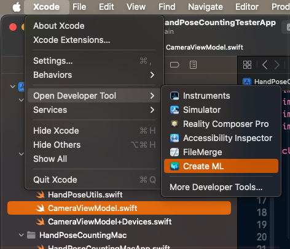

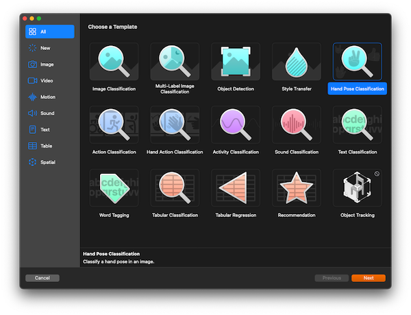

I have to say, Apple did well on easy-to-use department. I clicked around and just followed the
instructions. Everything seemed to work (with only a few trails and errors).

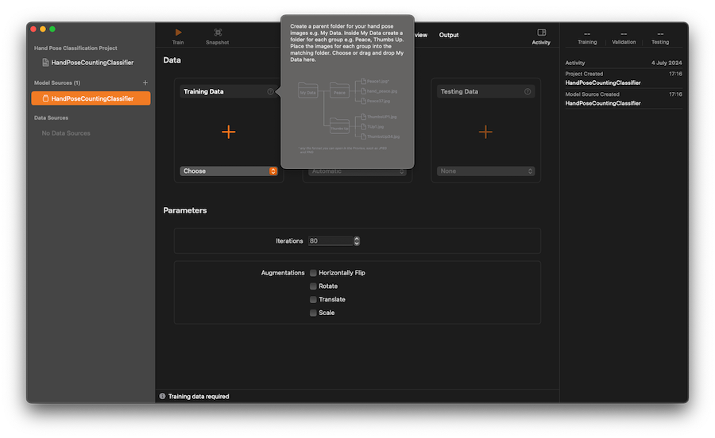

_Right!_ Looking at the pop-up hint. 

It gave an instruction on the training process - okey, this should be as simple as creating a folder structure for training, testing, and validation. Within each folder, create a sub-folder for each label. Then, my guess, for each label, give it a set of images that represents each number. _Easy!_

Let's prepare Training Directories and Data.

```bash
$ mkdir mldata
$ cd mldata
$ mkdir training testing validation
```

Create 10 sub directories for each.

```bash
$ cd training
$ mkdir 1 2 3 4 5 6 7 8 9 10
```

Repeate the above command for `testing` and `validation` folders.

Now, I just needed some images to train my Hand Pose classifier. I took several pictures of my hand gestures and put them under each folder. By the way, I used American Sign Language for counting with one hand. For more information, please see References section below.

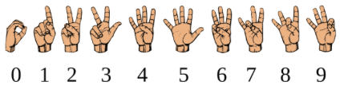

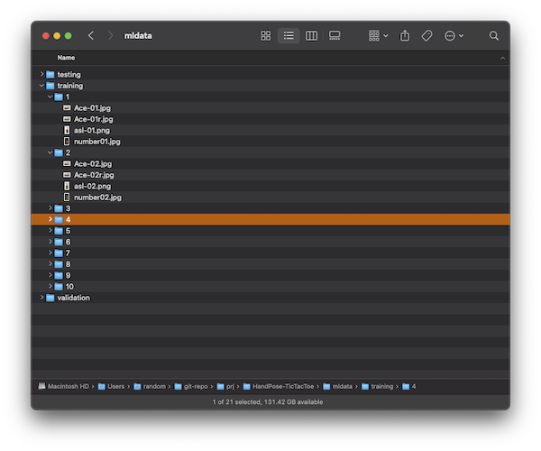


Again, the goal for this post is to demonstrate **simplicity**, so we will keep the training process as simple as possible. We will keep it to minimum, i.e. 2-4 images for each label. I opted to not provide images for testing for now and let the tool auto generate test images by subsetting them from the training images. We can always come back here and retrain our ML model, see Part 4 below.
Once, Create ML tool has enough images, the train button should be enabled. 

Start training ML

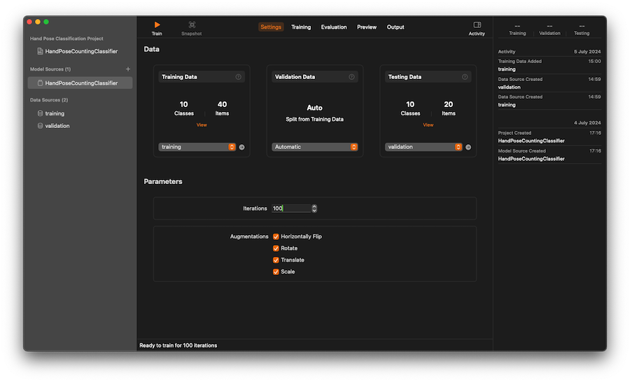

Training

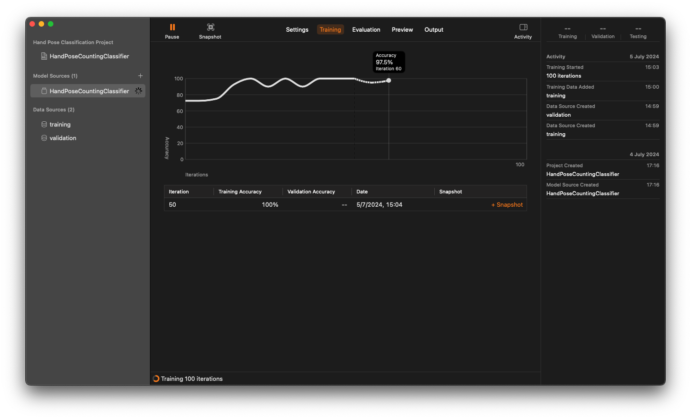

After training process is completed, you can inspecting the result in each tab.
You can even view a live preview!

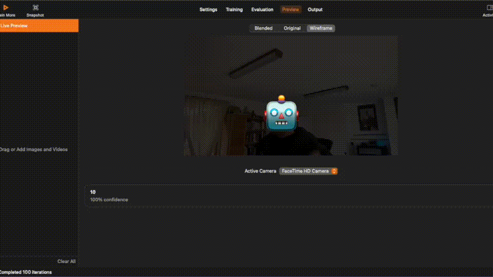

The final step for this section is to produce a ML model that we can use in our code in the next section.

Select on the Output tab, and click 'Get' to export as `.mlmodel` file. Give it any name. Note that this name will be used as a class name for our ML classifier during our coding phase.

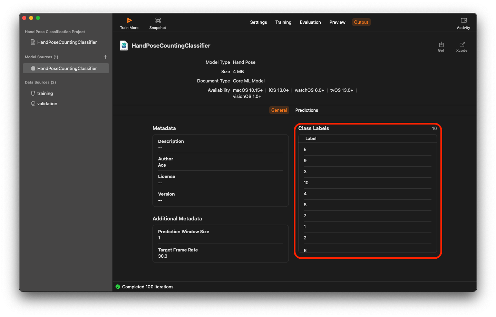
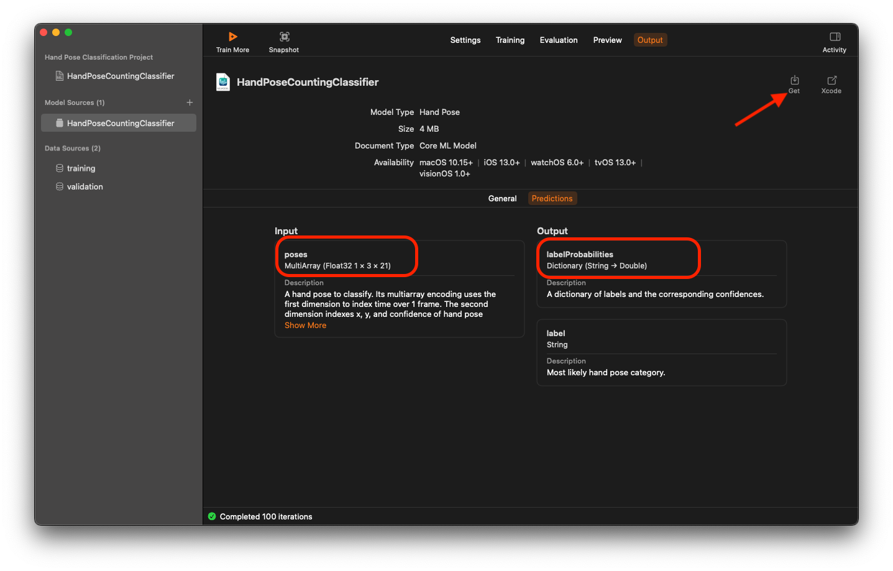
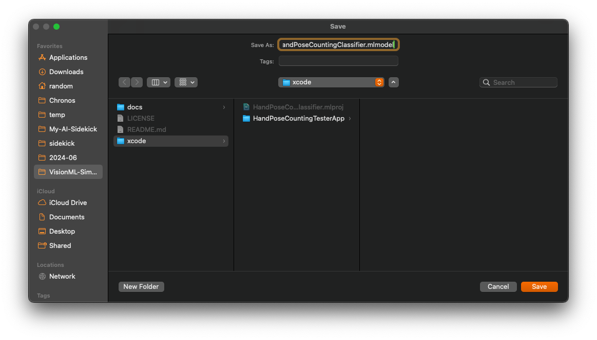


## Part 2 - Capture Images from Camera

Now, we have a Machine Learning model that classifies hand-pose images. Next, we need to get some images, from somewhere, to work with our ML model. 

We will use `AVFoundation` to capture images from device's camera and use them in our app. 

### Setup a camera

```swift
import AVFoundation
import Vision

class CameraViewModel: NSObject, ObservableObject {
    ...
    private let session = AVCaptureSession()
    private let videoOutput = AVCaptureVideoDataOutput()
    ...

    override init() {
        super.init()
        setupCamera()
        ...
    }
}
```

And the `setupCamera()` function.

```swift
    private func setupCamera() {
        session.beginConfiguration()

        guard let camera = getCaptureDevice(),  // (1) 
              let input = try? AVCaptureDeviceInput(device: camera),
              session.canAddInput(input) else {
            print("Error setting up camera input")
            return
        }

        session.addInput(input)

        let videoQueue = DispatchQueue(label: "videoQueue")
        videoOutput.setSampleBufferDelegate(self, queue: videoQueue)    // (2)
        videoOutput.videoSettings = [
            kCVPixelBufferPixelFormatTypeKey as String: kCVPixelFormatType_32BGRA
        ]

        guard session.canAddOutput(videoOutput) else {
            print("Error adding video output")
            return
        }

        session.addOutput(videoOutput)
        session.commitConfiguration()
        session.startRunning()
    }
```

(1) `getCaptureDevice()`, I want our app to run on both macOS and on iOS/iPadOS. Setting up
a camera on these devices requires platform-specific code. For example, on iPhone, I'd like to use
front-facing camera. I also want to keep our code simple and clean - not to pollute it with platform specific codes, 
To do this, I refactored the code that handles platform-specific out into a separate file.

```swift
extension CameraViewModel {
    ...
    func getCaptureDevice() -> AVCaptureDevice? {
#if os(macOS)
        guard let camera = AVCaptureDevice.default(for: .video) else {
            print("Error setting up camera input")
            return nil
        }
#else
        guard let camera = AVCaptureDevice.default(
            .builtInWideAngleCamera,
            for: .video, position: .front
        ) else {
            print("Error setting up camera input")
            return nil
        }
#endif
        return camera
    }

    // (3)
    func handleDeviceOrientation(connection: AVCaptureConnection) {
#if os(iOS)
        if connection.isVideoOrientationSupported,
           let videoOrientation = videoOrientationFor(deviceOrientation) {
            connection.videoOrientation = videoOrientation
        }
#endif
    }

    ...
}
```

(2) Next, I wanted to process the captured images. _Some how_.
Looking at `videoOutput.setSampleBufferDelegate(self, queue: videoQueue)`, the frameworkd will call delegate's function `captureOutput(_:didOutput:from)` passing `CMSampleBuffer` as an input. This is where we will process this data into the image that we can work with.

Let's conform to this protocol and then figure out what to do with the captured images.

```swift
extension CameraViewModel: AVCaptureVideoDataOutputSampleBufferDelegate {

    func captureOutput(
        _ output: AVCaptureOutput,
        didOutput sampleBuffer: CMSampleBuffer,
        from connection: AVCaptureConnection
    ) {
        guard let pixelBuffer = CMSampleBufferGetImageBuffer(sampleBuffer) else { return }
        handleDeviceOrientation(connection: connection)     // (3)

        // We will figure out what to do with the image here.
    }

}
```

(3) On iPhone, I needed to handle when the phone is rotated. Again this is platform specific handling, 
I wrapped this device-specific code inside a function to keep the main logic clean. As you can see, 
`handleDeviceOrientation(connection:)` doesn't do anything for `macOS` as I don't expect to rotate my mac around 😉.


### Display the captured images

At this point, the app looks very dumb and dull. _Does it even do anything?_
Let's add some code to show that our app actually captures images from the camera.

```swift
extension CameraViewModel: AVCaptureVideoDataOutputSampleBufferDelegate {

    func captureOutput(
        _ output: AVCaptureOutput,
        didOutput sampleBuffer: CMSampleBuffer,
        from connection: AVCaptureConnection
    ) {
        guard let pixelBuffer = CMSampleBufferGetImageBuffer(sampleBuffer) else { return }
        handleDeviceOrientation(connection: connection)     // (3)

        updateFrameImage(pixelBuffer)   // (4b)
    }

}
```

Let's update our `CameraViewModel` to publish an image for each frame that we capture.

```swift

#if os(macOS)
typealias HandPoseImage = NSImage
#else
typealias HandPoseImage = UIImage
#endif

class CameraViewModel: NSObject, ObservableObject {
    @Published @MainActor var frameImage: HandPoseImage?    // (4a)
    ...
}
```

At (4b), I added a call to a function that creates an image for each frame captured from the camera.

At (4a), we will store it as a class property. We will also publish it so that it can be used (by caller) to display in our 
SwiftUI view.

```swift
...
    func updateFrameImage(_ pixelBuffer: CVImageBuffer) {
        let ciImage = CIImage(cvPixelBuffer: pixelBuffer)
        let context = CIContext()
        guard let cgImage = context.createCGImage(ciImage, from: ciImage.extent) else { return }
#if os(macOS)
        let image = NSImage(cgImage: cgImage, size: .zero)
#else
        let image = UIImage(cgImage: cgImage)
#endif
        DispatchQueue.main.async {
            self.frameImage = image
        }
    }
```

We can use this image, here, for example.

```swift
import SwiftUI
struct ContentView: View {
    @StateObject private var cameraViewModel = CameraViewModel()

    var body: some View {
        ZStack {
            if let frameImage = cameraViewModel.frameImage {
                HandPoseImageView(handPoseImage: frameImage)
                    .frame(maxWidth: .infinity, maxHeight: .infinity)
                    }
            } else {
                Text("No Camera Feed")
            }
        }
        .background(Color.black)
        .edgesIgnoringSafeArea(.all)
    }
}

...
struct HandPoseImageView: View {
    var handPoseImage: HandPoseImage
    var body: some View {
#if os(macOS)
        Image(nsImage: handPoseImage)
            .resizable()
            .scaledToFit()
#else
        Image(uiImage: handPoseImage)
            .resizable()
            .scaledToFit()
#endif
    }
}

```

At this point, I can now see my handsome face doing some silly gestures to the camera.

_Excellent!_


## Part 3 - Using ML Model for Hand Pose Classification

### Loading Hand Post Classification Model

Now, it's time to use our ML model that we created from part 1. To do this, simply, drag and drop our
`mlmodel` file into Xcode.

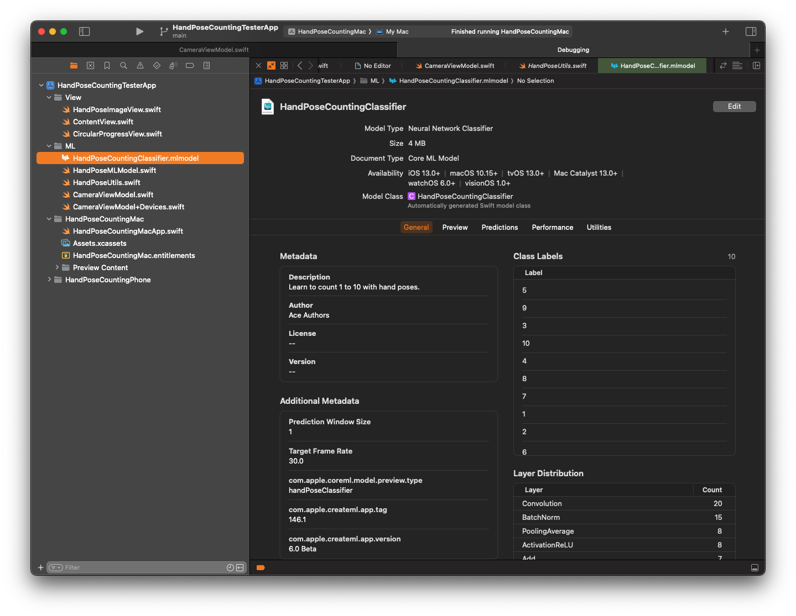

We will load this ML model into our `CameraViewModel`.

```swift
class CameraViewModel: NSObject, ObservableObject {
    @Published @MainActor var frameImage: HandPoseImage?
    ...
    private var mlModel: HandPoseMLModel!
    ...

    override init() {
        super.init()
        setupCamera()

        Task {
            do {
                mlModel = try await HandPoseMLModel.loadMLModel()
                ...
            } catch {
                print("ERROR: Initialising ML classifier: \(error)")
            }
        }
    }
    ...
}
```

`HandPoseMLModel` is really a simple class that wraps around `MLModel`.

```swift
final class HandPoseMLModel: NSObject, Identifiable {
    let mlModel: MLModel

    private var classLabels: [Any] {
        mlModel.modelDescription.classLabels ?? []
    }

    init(mlModel: MLModel) {
        self.mlModel = mlModel
    }

    func predict(poses: HandPoseInput) throws -> HandPoseOutput? {
        let features = try mlModel.prediction(from: poses)
        let output = HandPoseOutput(features: features)
        return output
    }
}
```

And to load our ML model.

```swift
extension HandPoseMLModel {
    static func loadMLModel() async throws -> HandPoseMLModel? {
        do {
            let model = try HandPoseCountingClassifier(configuration: MLModelConfiguration()).model
            return HandPoseMLModel(mlModel: model)
        } catch {
            return nil
        }
    }
    ...
}
```

### Using Hand-Pose ML Model 

We now can use our ML model to predict hand poses from images captured via our camera.
Let modify our `captureOutput(_:didOutput:from)` function to use this classifier, see (5).

```swift
    func captureOutput(
        _ output: AVCaptureOutput,
        didOutput sampleBuffer: CMSampleBuffer,
        from connection: AVCaptureConnection
    ) {
        guard let pixelBuffer = CMSampleBufferGetImageBuffer(sampleBuffer) else { return }
        handleDeviceOrientation(connection: connection)
        predictHandPose(pixelBuffer)    // (5)
        updateFrameImage(pixelBuffer)
    }
```

The function implementation is here.

```swift
    private func predictHandPose(_ pixelBuffer: CVImageBuffer) {
        ...
        // (6)
        let imageRequestHandler = VNImageRequestHandler(cvPixelBuffer: pixelBuffer, orientation: .up)
        Task { @MainActor in
            do {
                try imageRequestHandler.perform([handPoseRequest])      // (7)
                if let observation = handPoseRequest.results?.first {
                    let poseMultiArray = try observation.keypointsMultiArray()
                    let input = HandPoseInput(poses: poseMultiArray)
                    if let prediction = try mlModel.predict(poses: input) {     // (8)
                        print("Hand pose: \(prediction.label)")
                    }
                }
            } catch {
                print("Error performing request: \(error)")
            }
        }
    }
```

(6), Notice that our ML classifier accepts multi-array of hand postures. Apple provides a framework
, see 'import Vision' at the top of 'CameraViewModel') to handle the bulk of the work here. 
In order to use Vision, we need to create a hand-pose request, see (7). Let's add a property to 
our model to keep track of this request.

```swift

class CameraViewModel: NSObject, ObservableObject {
    @Published @MainActor var frameImage: HandPoseImage?
    ...
    private var mlModel: HandPoseMLModel!

    // (7)
    lazy private var handPoseRequest: VNDetectHumanHandPoseRequest = {
        let request = VNDetectHumanHandPoseRequest()
        request.maximumHandCount = 1
        return request
    }()
    ...

    override init() {
        super.init()
        ...
    }

    ...
}
```

(8) now that we've converted a captured image into multi-array, we can feed it as an input to our
ML model. Our ML model gives best prediction for a given image. Running our app at this stage, 
you should see our ML model predicts each gesture and displays the outputs (as string) in the Xcode's debug
console. 

_Now, What are we going to do with this power?_

From here on, the usage is limited only by our imagination!

## Part 4 - (Re)Training you ML Model

From the demo video at the beginning of this post, you may notice that the ML model struggles
to recognise hand-pose for number 3. This is true as the training steps was simplified.
The objective was to provide a *minimum* skeletal framework of Xcode project to get
Apple Vision and Hand Pose ML to work at its simplesticity (I made up a new word here).

Now that we have a skeletal working project. Training and retraining can be done simply by
repeating Part 1 - Create ML Model, this can be repeated until the model produces satisfactory accuracy. 
For example, you might like to give more variety of images for each number. Perhaps, give 
different set of images for different background, and etc. Then, regenerate the output ML model file.
The new `.mlmodel` file can be dropped into the Xcode (replacing the old one), then rebuild the new 
version of the app.

## Part 5 - Let's do something fun!

I am working our some fun project that utilises our ML model and the Vision framework. If you are interested,
please check back here again to see what I come up with.

Thank you for reading my post.

Peace, 

Ace


## References

1. [Github: VisionML-Simplified (This Project)](https://github.com/primecoder/VisionML-Simplified)

2. [Apple Developer - Recognizing Gestures with Machine Learning](https://developer.apple.com/tutorials/sample-apps/getstartedwithmachinelearning-recognizegestures)

3. [Wikipedia - American Sign Language](https://en.wikipedia.org/wiki/American_Sign_Language)

4. [ASL Numbers Discussion](https://www.lifeprint.com/asl101/pages-layout/numbersdiscussion.htm)

